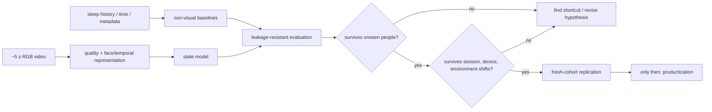

# Lucent

> **Can five seconds of ordinary front-camera video reveal anything real about fatigue and cognitive performance?**

[](https://github.com/sushxnthd/lucent/actions/workflows/ci.yml)

Lucent is a research program investigating whether brief, commodity RGB video contains a **generalizable state signal** for fatigue and cognitive performance.

The project grew out of [Somno](https://sushxnthd.github.io/somno/), a sleep-debt system that combined reaction-time testing, facial fatigue signals, subjective sleepiness, and longitudinal sleep history. Somno exposed a practical bottleneck: repeated explicit measurement creates friction. Lucent asks how much of that measurement stack can disappear.

This repository contains the research only. There is no product UI here.

## The five-second hypothesis

The working hypothesis is deliberately narrow:

> A short front-camera clip may contain enough temporal information to predict part of a person's **current deviation from their own alert baseline**, beyond what can be explained by identity, time of day, sleep history, device, or environment alone.

That is a hypothesis, not a claim.

The hard problem is not training a model that looks accurate. The hard problem is proving that it learned **state instead of shortcuts**.

## Why this is difficult

A facial-video model can appear impressive while learning the wrong thing:

- who the person is;
- which device recorded them;
- where or when a session was recorded;
- lighting, exposure, pose, or background;
- stable facial morphology;
- collection-order artifacts;
- label leakage from the experimental procedure.

A random clip split can therefore produce a strong score and still tell us almost nothing about whether Lucent works.

Lucent treats leakage resistance as part of the research question, not an afterthought.

## Research loop



## What would actually convince us?

A headline validation score is not enough. The core thesis becomes interesting only if a short-video model:

1. beats trivial, sleep-history-only, and static-frame baselines;
2. retains useful performance on **participants never seen during training**;
3. adds information beyond identity and collection artifacts;
4. survives session, device, lighting, and environment shifts;
5. produces calibrated uncertainty rather than confident nonsense;
6. reproduces on a fresh collection.

Until then, the correct status is **research in progress**.

## Current status

**Phase 0: validation architecture is locked.**

The repository now contains the falsifiable thesis, anti-leakage protocol, evaluation code, synthetic leakage demonstration, data contract, and preregistration template. No headline performance result is published before the participant-held-out protocol is satisfied.

## Repository map

| Path | Purpose |
| --- | --- |
| [RESEARCH.md](RESEARCH.md) | thesis, hypotheses, confounds, falsification criteria |
| [EXPERIMENTS.md](EXPERIMENTS.md) | experimental program and evaluation logic |
| [ROADMAP.md](ROADMAP.md) | staged path from pilot to fresh-cohort replication |
| [REFERENCES.md](REFERENCES.md) | literature and benchmark map |
| [docs/PREREGISTRATION_TEMPLATE.md](docs/PREREGISTRATION_TEMPLATE.md) | lock hypotheses and analysis before looking at outcomes |
| [docs/FAILURE_MODES.md](docs/FAILURE_MODES.md) | ways a convincing result can still be wrong |\n| [docs/POSITIONING.md](docs/POSITIONING.md) | how Lucent differs from ordinary drowsiness classification |\n| [docs/OPEN_QUESTIONS.md](docs/OPEN_QUESTIONS.md) | ordered research questions that can kill or narrow the thesis |
| [data/README.md](data/README.md) | proposed data contract, privacy, and collection rules |
| [results/README.md](results/README.md) | publication rules for positive and negative results |
| [src/lucent/](src/lucent/) | split and evaluation utilities |
| [experiments/synthetic_identity_leakage.py](experiments/synthetic_identity_leakage.py) | executable demonstration of why random splits are dangerous |

## Reproduce the leakage demo

```bash
git clone https://github.com/sushxnthd/lucent.git
cd lucent
python -m venv .venv
# Windows: .venv\Scripts\activate
# macOS/Linux: source .venv/bin/activate
pip install -e ".[dev]"
python experiments/synthetic_identity_leakage.py
pytest -q
```

The synthetic experiment deliberately creates repeated observations from the same people. A random split lets a flexible model exploit identity. A participant-held-out split removes that shortcut and exposes the apparent performance inflation.

## Research principles

- **Falsifiable before flashy.**
- **Split by person before reporting performance.**
- **Baselines before bigger models.**
- **Ablations before explanations.**
- **Negative results are results.**
- **Product claims come after replication, not before it.**

## Scope

Lucent is research into low-friction measurement of fatigue and cognitive-performance state from ordinary sensors. It is not presented here as a diagnostic system and it does not assume that a universal "fatigue score" exists.

The immediate objective is simpler: determine exactly **which measurable state variables survive rigorous out-of-sample testing from a few seconds of video**.
